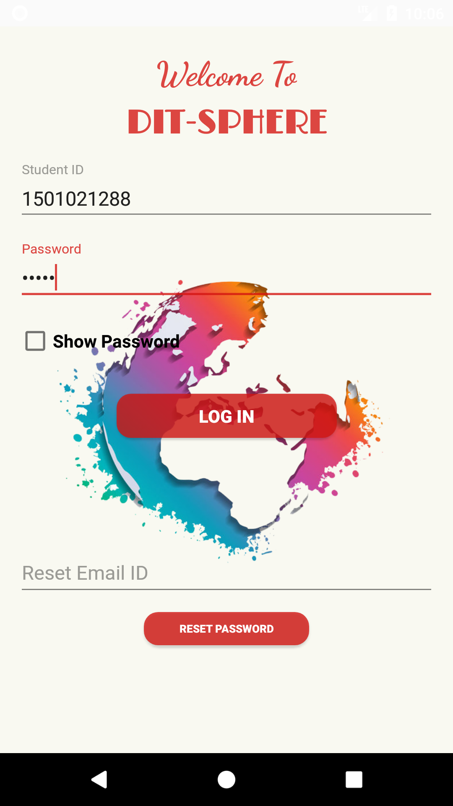
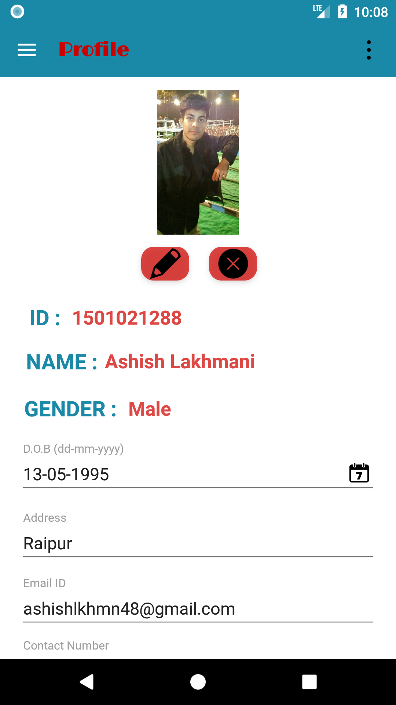
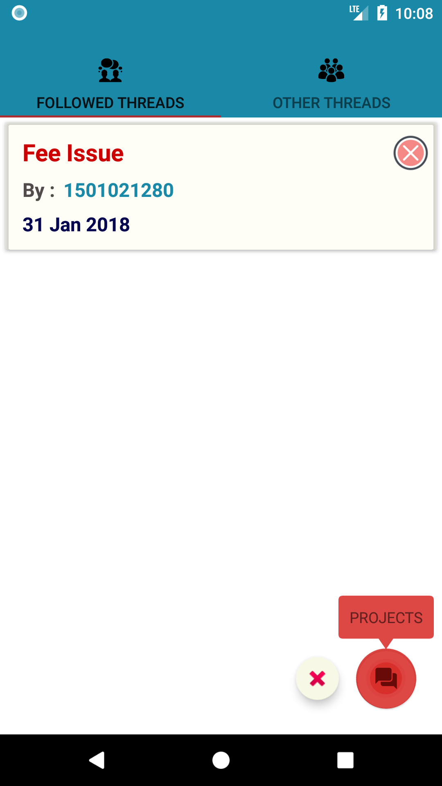
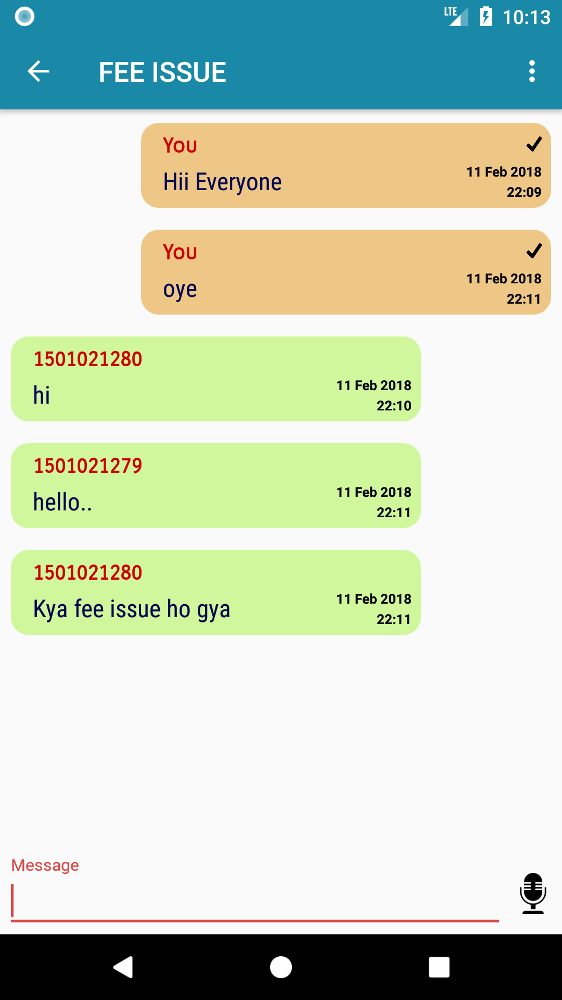
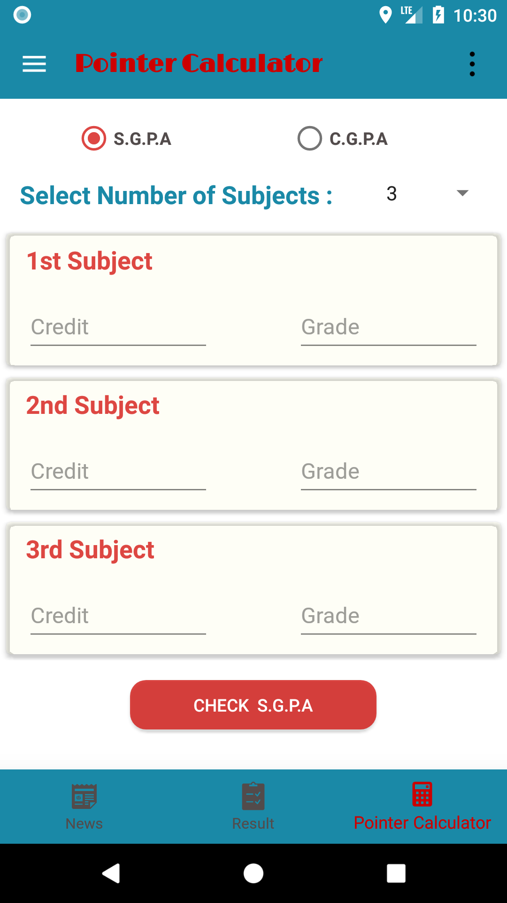

# DIT SPHERE 

<h1>WHY DIT-SPHERE?</h1>

DIT has been functioning with a website based system since its inception
providing the information related with news, announcement and Upcoming
events detail whereas every other institution is using all the modern amenities like
Applications for all these things.

So, being a reputed technical university, DIT should also have an Application
based student portal where students can track the updates via live notification
system.

<b>Being a DIT-ian, many of us face several problems like:</b>
  <ul>
  <li>Not getting aware of every news, announcement or upcoming event at time.</li>
  <li>Less interaction between Junior and senior.</li>
  <li>Issue in calculation pointers.</li>
  <li>Clubs have to do publicity in classes.</li>
</ul>

<b>The Student portal will help Student for the following things:</b>
<ul>
  <li>News and Upcoming Events Notifications</li>
  <li>Discussion forum</li>
  <li>Clubs </li>
  <li>Result section</li>
  <li>Pointer calculation system.</li>
</ul>

<h1>Technologies Used</h1>
<ul>
<li>ANDROID Libraries</li>
<li>JAVA</li>
<li>Parse Server hosted on Back4app Platform</li>
<li>PHP</li>
<li>MYSQL</li>
</ul>

<h1>References</h1>
  <ul>
  <li>https://docs.back4app.com</li>
  <li>https://github.com/parse-community/Parse-SDK-Android</li>
  <li>https://github.com/parse-community/parse-php-sdk</li>
  <li>https://developer.android.com/reference/org/w3c/dom/Document.html</li>
  <li>https://stackoverflow.com</li>
</ul>

<h1>Glimpses of DIT SPHERE</h1>
<table>
  <tr>
    <th>  </th>
    <th>  </th>
    <th>  </th>
  </tr>
  <tr>
    <th>  </th>
    <th>  </th>
    <th>  </th>
  </tr>
    <tr>
    <th>  </th>
    <th>  </th>
    <th>  </th>
  </tr>
  </table>
  <b>And Many More..</b>

<h1>Apk of DIT SPHERE</h1>
<a href = "https://raw.githubusercontent.com/ashishlkhmn48/DIT_SPHERE/master/images/sphere.apk">Click to Download</a>

<h1>Backend Files of DIT SPHERE for Reference</h1>
https://github.com/ashishlkhmn48/DIT_Sphere_Files
